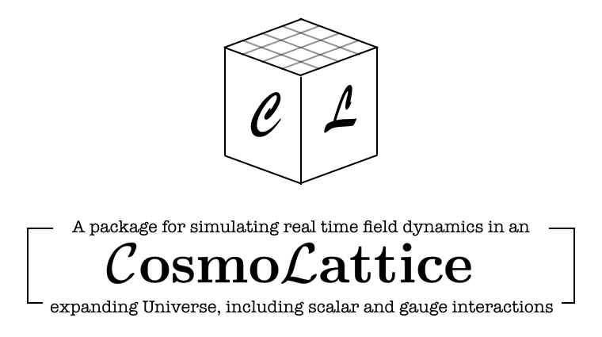

## What is CosmoLattice?

CosmoLattice is a program designed to simulate the evolution of **interacting scalar and gauge
fields in an expanding universe**. It can simulate (so far) the dynamics of 1) global theories, ii) Abelian U(1) gauge theories, and iii) non-Abelian SU(2) gauge theories. It can simulate the dynamics of such fields either in a flat space-time background, or in a homogeneous and isotropic (spatially flat) expanding background. CosmoLattice is written in C++, and is fully parallelized using Message Passing Interface (MPI).

## Download

CosmoLattice can be downloaded from the GitHub repository **[cosmolattice/cosmolattice](http://https://github.com/cosmolattice/cosmolattice)**

## If you use CosmoLattice

- Please cite [arXiv:2006.15122](https://arxiv.org/pdf/2101.XXXXX.pdf) and [arXiv:2101.XXXXX](https://arxiv.org/pdf/2101.XXXXX.pdf) in your research.
- Let us now if you publish a paper using CosmoLattice. We plan to upload a list of papers to this website in the future.

## Documentation

- _User manual_: Explains how to install CosmoLattice and run scalar and gauge simulations.
[arXiv:2101.XXXXX](https://arxiv.org/pdf/2101.XXXXX.pdf)

- _The art of simulating the early universe_: A dissertation meant as a primer on lattice techniques for the simulation of scalar-gauge field theories. It provides the theoretical basis for the equations implemented in CosmoLattice.

[arXiv:2006.15122](https://arxiv.org/pdf/2006.15122.pdf)

## Mailing list

We have created a mailing list in order to share information on new updates, report buggs, inform about events, etc. In order to subscribe, send a blank e-mail to: **[cosmolattice+subscribe@googlegroups.com](cosmolattice+subscribe@googlegroups.com)**

## Authors 

- Daniel G. Figueroa (IFIC, UV/CSIC)
- Adrien Florio (Stony Brook U.)
- Francisco Torrenti (U. Basel)
- Wessel Valkenburg

## Contact

Send an e-mail to: daniel.figueroa@ific.uv.es, adrien.florio@stonybrook.edu, f.torrenti@unibas.ch
