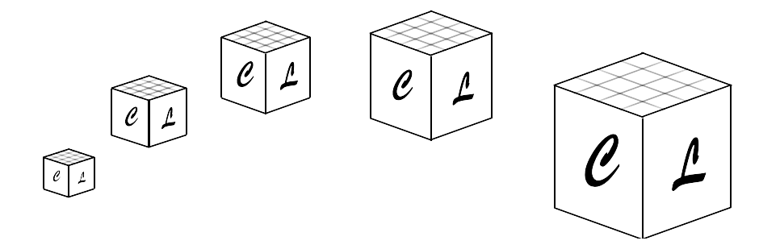
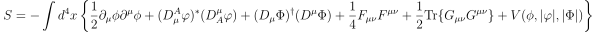
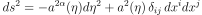

  

# What is CosmoLattice?

CosmoLattice is a modern package for **lattice simulations of interacting field dynamics in 
an expanding universe**. We have developed CosmoLattice with the intention of providing a 
new up-to-date, relevant numerical tool for the scientific community working in the **physics 
of the early universe**.

The current version of CosmoLattice (**version 1.0**) can simulate the dynamics of 1) global 
theories, ii) Abelian U(1) gauge theories, and iii) non-Abelian SU(2) gauge theories, both 
in flat and (spatially flat) FLRW backgrounds.  As such, it can simulate the dynamics of 
field theories described by an action and metric of the type:

  

  

However, we conceive CosmoLattice as an **evolving package that we plan to upgrade constantly**, 
by further developing new modules for other tasks. To mention just a few, we plan to add in the 
future the computation of gravitational waves (**now in development!**), an initializer for the 
creation a cosmic defects, the handing of theories with non-canonical kinetic terms, and the 
inclusion of axion-couplings to a gauge sector. 

The creators of CosmoLattice are **Daniel G. Figueroa**, **Adrien Florio**, 
**Francisco Torrenti**, and **Wessel Valkenburg**.

## Some features:

CosmoLattice incorporates a series of features that makes it very versatile and powerful. 
We list some of them:
 
-  It is written in **C++**, and  fully exploits the object oriented programming paradigm, 
with a modular structure and a clear separation between the physics and the technical details.
-  It is **MPI-based** and uses a **discrete Fourier transform parallelized in multiple 
spatial dimensions**, which makes it specially appropriate for probing scenarios with 
well-separated scales, running very high resolution simulations, or simply very long ones.
- It introduces its own **symbolic language**, defining field variables and operations 
over them. This way, one can introduce differential equations and operators in a manner 
as close as possible to the continuum.
-  it includes a library of **numerical algorithms**, ranging from second-order to tenth-order 
accuracy methods, suitable for simulating global and gauge theories 
in an expanding grid.
- Our algorithms **conserve energy up** to the accuracy set by the order of the evolution 
algorithm, reaching even machine precision in the case of the highest order integrators. 
Our algorithms for gauge theories also respect the **Gauss constraint to machine precision**.
- **Relevant observables** are provided for each algorithm, such as field amplitudes and 
spectra,  energy density, or lattice snapshots. 

## Documentation

- ***The art of simulating the early universe***. [[**arXiv:2006.15122**]](https://arxiv.org/pdf/2006.15122.pdf). 
A dissertation meant as a primer on lattice techniques for the simulation of scalar-gauge field theories. 
It provides the theoretical basis for the equations implemented in CosmoLattice. 

- _**CosmoLattice user manual**_. [[**arXiv:2102.XXXXX**]](https://arxiv.org/pdf/2102.XXXXX.pdf). 
This manual explains in detail the use an structure of the code, including: 1) how to install 
CosmoLattice and the different required libraries, 2) the general structure of the code and 
the most important files, 3) how to set up and run a simulation for the first time, for both 
scalar and scalar-gauge theories.

## If you use CosmoLattice

- CosmoLattice is freely available to anyone who wants to use or modify it. However, whenever 
using CosmoLattice in your research, no matter how much (or little) you modify the code, 
**please cite both [arXiv:2006.15122](https://arxiv.org/pdf/2101.XXXXX.pdf) 
and [arXiv:2102.XXXXX](https://arxiv.org/pdf/2101.XXXXX.pdf) in your papers**. 

- Also, if you publish a paper using CosmoLattice, we would love to hear about them. We 
plan to keep an **updated list of papers** using the code in this website.

- Finally, if you would like to **help developing** some aspects of CosmoLattice, or even 
implement your own modules with some new functionality we have not envisaged, please contact 
us and let us know about your idea(s).

## Download

CosmoLattice can be downloaded from the **GitHub repository**: 
**[cosmolattice/cosmolattice](http://github.com/cosmolattice/cosmolattice)**

## Mailing list

We have created a mailing list in order to share information on new updates, report bugs, 
inform about events, etc.  In order to subscribe, send a blank e-mail to: 
<a href="mailto:cosmolattice+subscribe@googlegroups.com">**cosmolattice+subscribe@googlegroups.com**</a>

## Contact
 If you have any questions or comments about CosmoLattice, please send us an e-mail to: **<daniel.figueroa@ific.uv.es>**, **<adrien.florio@stonybrook.edu>**, **<f.torrenti@unibas.ch>**
