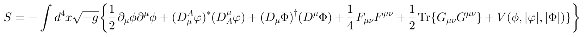
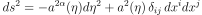

### What is CosmoLattice?

CosmoLattice is a modern package for **lattice simulations of field dynamics in
an expanding universe**. We have developed CosmoLattice to provide a
new up-to-date, relevant numerical tool for the scientific community working in the **physics
of the early universe**.

CosmoLattice can simulate the dynamics of i) interacting
scalar field theories, ii) Abelian U(1) gauge theories, and iii) non-Abelian SU(2) gauge theories, either
in flat spacetime or an expanding FLRW background, including the case of self-consistent expansion sourced by
the fields themselves. CosmoLattice is ready to simulate the dynamics of field theories described by an action
and a background metric of the type:

  

  

We have conceived CosmoLattice as an **evolving package that we plan to upgrade successively**,
by further developing modules for new tasks. For instance, we have recently added in CosmoLattice v1.1 (released in May 2022) 
a new module for the computation of gravitational waves from scalar field sectors. **A new version (v1.2) of CosmoLattice has been released in Jun 2023 with the addition of a module to compute gravitational waves sourced by U(1) Abelian Gauge fields**. CosmoLattice is in fact a platform to implement any system of dynamical equations suitable for discretization on a lattice, as it introduces its own language describing fields and operations between them, and hence it is a natural platform to implement new libraries to solve arbitrary field problems (related or not to cosmology).

Check the website for <b><a href="../technicalnotes">technical notes</a></b> and <b><a href="../allversions">release updates</a></b>.

### If you use CosmoLattice

CosmoLattice is freely available to anyone who wants to use or modify it. However, whenever
using CosmoLattice in your research, no matter how much (or little) you modify the code,
<b>please cite both <a href="https://arxiv.org/pdf/2006.15122.pdf" target="_blank" rel="noopener noreferrer">arXiv:2006.15122</a> and 
<a href="https://arxiv.org/pdf/2102.01031.pdf" target="_blank" rel="noopener noreferrer">arXiv:2102.01031</a> in your papers</b>. Also, if you publish a paper using CosmoLattice, we would love to hear about it. We
plan to keep an **updated list of papers** using the code on this website.

### Mailing list

We have created a mailing list in order to share information on new updates, report bugs,
inform about events, etc.  In order to subscribe, send a blank e-mail to:
<a href="mailto:cosmolattice+subscribe@googlegroups.com">**cosmolattice+subscribe@googlegroups.com**</a>

#### Authors

- <a href="https://webific.ific.uv.es/web/content/figueroa-daniel-g" target="_blank" rel="noopener noreferrer">Daniel G. Figueroa</a> - <daniel.figueroa@ific.uv.es>
- <a href="https://afloriosite.wordpress.com/" target="_blank" rel="noopener noreferrer">Adrien Florio </a> - <adrien.florio@stonybrook.edu>
- <a href="http://ftorrenti.github.io"  target="_blank" rel="noopener noreferrer">Francisco Torrenti</a> - <f.torrenti@uv.es>
- Wessel Valkenburg\*  
\* Wessel is currently living 'la vida loca' out of academia
